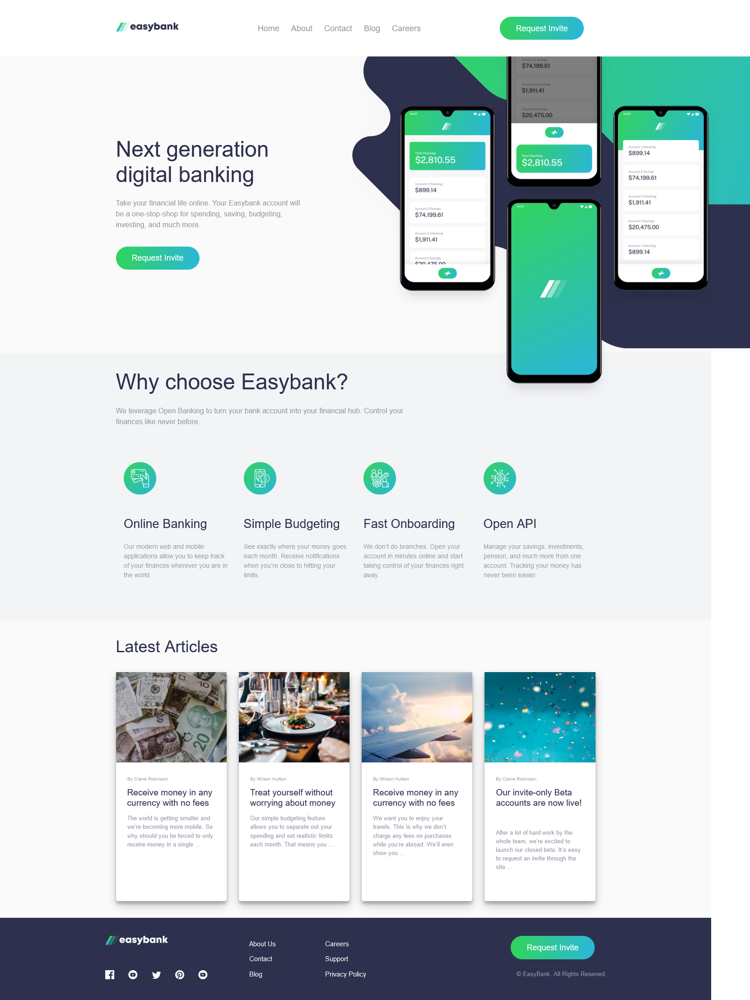

# Frontend Mentor - Easybank landing page solution

This is a solution to the [Easybank landing page challenge on Frontend Mentor](https://www.frontendmentor.io/challenges/easybank-landing-page-WaUhkoDN). Frontend Mentor challenges help you improve your coding skills by building realistic projects.

## Overview

### The challenge

Users should be able to:

- View the optimal layout for the site depending on their device's screen size
- See hover states for all interactive elements on the page

### Screenshot

### Links

- Solution URL: [https://www.frontendmentor.io/solutions/easybank-hfZ1Vk03X](https://www.frontendmentor.io/solutions/easybank-hfZ1Vk03X)
- Live Site URL: [https://farukerge.github.io/easybank-landingpage/](https://farukerge.github.io/easybank-landingpage/)

## My process

### Built with

- Semantic HTML5 markup
- CSS custom properties
- Flexbox
- CSS Grid
- Mobile-first workflow
- SASS

## Author

- Frontend Mentor - [@corv0-0](https://www.frontendmentor.io/profile/corv0-9)
